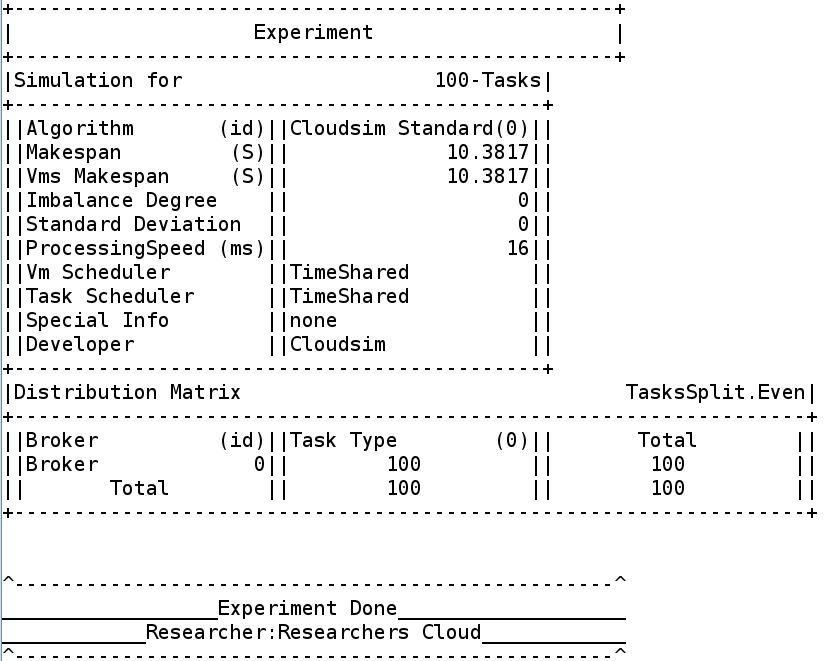

<!-- 
Useful links
code inspector          | https://code-inspector.com 
create shields          | https://shields.io
markdown ref style      | https://markdownguide.org/basic-syntax/#reference-style-links 
-->

<!-- variable definition -->
<!-- shields -->
[contributors-shield]: https://img.shields.io/github/contributors/cypherskar/ReCLoud?style=flat-square
[contributors-url]: https://github.com/cypherskar/ReCloud/graphs/contributors
[downloads-shield]: https://img.shields.io/github/downloads/cypherskar/ReCloud/total?style=flat-square
[vulnerabilities-shield]: https://img.shields.io/snyk/vulnerabilities/github/cypherskar/recloud?style=flat-square
[code-grade]: https://www.code-inspector.com/project/24753/status/svg
[code-quality]: https://www.code-inspector.com/project/24753/score/svg
<!-- references -->
[Cloudsim]: https://github.com/Cloudslab/cloudsim/tree/cloudsim-4.0


<!-- entry -->
# Researchers Cloud 
![code-grade]
![code-quality]
![vulnerabilities-shield]
![downloads-shield]
[![contributors-shield]][contributors-url]

<!-- description -->
A simulation library based on [Cloudsim] that aims to offer many methods to automate replication of various simulation scenarios.

### Why not use Cloudsim directly?
> I faced alot of difficulties during my masters studies and alot of time was consumed by the process of re-implementating the research papers' algorithm/s instead of focusing on the actual improvments that could be done on any algorithm. Therefore, i created this tool to help me replicate all of those various experimentation scenarios with few lines of code as possible and as scalable and flexible as i can make them.

### Features Include:
> - Simplify process of creating, modifying and deleting cloudsim entities.
> - Create random attributes and automate enitity instantiation.
> - Control the distribution of created cloudlets over brokers, such as: Even or Random.
> - Integrate scheduling algorithms and control cloudsim process easily.
> - Packed with implementations of several famous cloud algorithms such as: Honey Bee and PSO.
> - Display experiment outcomes in form of tables, charts and log files.

_Help me expand base of implemented cloud algorithms_

## Simplest example
Create a `ReCloud` instance to start configuring experiment fields, then launch instance through `Recloud.launch()`:
```java
// Create a ReCloud instance.
ReCloud recloud = new ReCloud();

// Create a datacenters/server.
recloud.servers().newServer().make();

// Create a host.
recloud.servers().newHost().make();

// Create a broker.
recloud.jobs().newBroker().make();

// Create a virtual machine.
recloud.jobs().newVm().make();

// Create a cloudlets (Task).
recloud.jobs().newTask().make();

// Add wanted simulations to experiment.
recloud.experiment().newSimulations(new CloudsimSimulation());

// Add goal for number of cloudlets created.
recloud.experiment().taskTargets(100, 200);

// Launch.
ReCloud.launch(recloud);
```
The above code launches a gui menu that yields the following outcomes:
<p float="left">
  
  
  
</p>

